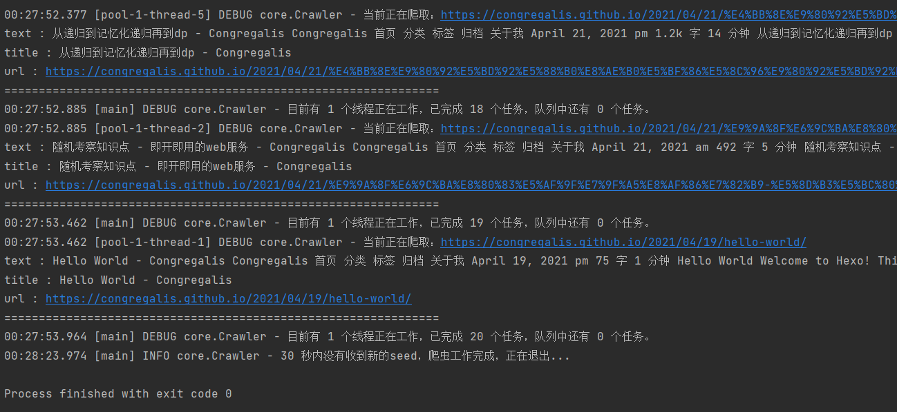

<div id="top"></div>

<!-- PROJECT SHIELDS -->
<!--
*** I'm using markdown "reference style" links for readability.
*** Reference links are enclosed in brackets [ ] instead of parentheses ( ).
*** See the bottom of this document for the declaration of the reference variables
*** for contributors-url, forks-url, etc. This is an optional, concise syntax you may use.
*** https://www.markdownguide.org/basic-syntax/#reference-style-links
-->
[![Contributors][contributors-shield]][contributors-url]
[![Forks][forks-shield]][forks-url]
[![Stargazers][stars-shield]][stars-url]
[![Issues][issues-shield]][issues-url]
[![MIT License][license-shield]][license-url]


<!-- PROJECT LOGO -->
<br />
<div align="center">
<a href="https://github.com/Congregalis/tiny-crawler">
    
</a>

<h3 align="center">Tiny-Crawler</h3>

  <p align="center">
    小而实用的 Java 爬虫框架，主要用于学习爬虫框架的运作原理。
    <br />
    <a href="https://github.com/Congregalis/tiny-crawler"><strong>查看文档 »</strong></a>
    <br />
    <br />
    <a href="https://github.com/Congregalis/tiny-crawler#%E7%94%A8%E6%B3%95">演示</a>
    ·
    <a href="https://github.com/Congregalis/tiny-crawler/issues">提交 Bug</a>
    ·
    <a href="https://github.com/Congregalis/tiny-crawler/issues">增加需求</a>
  </p>
</div>


<!-- TABLE OF CONTENTS -->
<details>
  <summary>目录</summary>
  <ol>
    <li>
      <a href="#关于本项目">关于本项目</a>
      <ul>
        <li><a href="#环境">环境</a></li>
      </ul>
    </li>
    <li>
      <a href="#使用本项目">使用本项目</a>
      <ul>
        <li><a href="#前置条件">前置条件</a></li>
        <li><a href="#安装项目">安装项目</a></li>
      </ul>
    </li>
    <li><a href="#用法">用法</a></li>
    <li><a href="#下一步工作">下一步工作</a></li>
    <li><a href="#参与贡献">参与贡献</a></li>
    <li><a href="#开源协议">开源协议</a></li>
    <li><a href="#联系方式">联系方式</a></li>
    <li><a href="#感谢">感谢</a></li>
  </ol>
</details>


<!-- ABOUT THE PROJECT -->
## 关于本项目

特性：
- 支持单机器上多线程高效爬取
- 支持多机器分布式部署，进一步提高爬取速度
- 支持自定义各组件，可扩展性强
- 使用 Jsoup 解析
- 代码易理解易学习，基于众多设计模式


本项目采用如上图所示结构来设计，保证了爬取的完整性。以下这几篇文章可能能让您更了解它。
- [如何实现一个简单的爬虫框架——设计篇](https://congregalis.github.io/2021/11/05/%E5%A6%82%E4%BD%95%E5%AE%9E%E7%8E%B0%E4%B8%80%E4%B8%AA%E7%AE%80%E5%8D%95%E7%9A%84%E7%88%AC%E8%99%AB%E6%A1%86%E6%9E%B6%E2%80%94%E2%80%94%E8%AE%BE%E8%AE%A1%E7%AF%87/)
- [如何实现一个简单的爬虫框架——下载篇](https://congregalis.github.io/2021/11/06/%E5%A6%82%E4%BD%95%E5%AE%9E%E7%8E%B0%E4%B8%80%E4%B8%AA%E7%AE%80%E5%8D%95%E7%9A%84%E7%88%AC%E8%99%AB%E6%A1%86%E6%9E%B6%E2%80%94%E2%80%94%E4%B8%8B%E8%BD%BD%E7%AF%87/)
- [爬虫框架优化——url去重](https://congregalis.github.io/2021/11/14/%E7%88%AC%E8%99%AB%E6%A1%86%E6%9E%B6%E4%BC%98%E5%8C%96%E2%80%94%E2%80%94url%E5%8E%BB%E9%87%8D/)

<p align="right">(<a href="#top">back to top</a>)</p>


### 环境

* Java
* Maven

<p align="right">(<a href="#top">back to top</a>)</p>


<!-- GETTING STARTED -->
## 使用本项目

以下步骤帮助您在本地安装并运行本项目。

### 前置条件

* java
* maven

### 安装项目

1. 通过 maven 使用， `pom.xml` 中加入
```xml
<repositories>
    <repository>
        <id>github-tiny-crawler-repo</id>
        <name>Tiny-Crawler on Github</name>
        <url>https://congregalis.github.io/tiny-crawler/maven-repo/</url>
    </repository>
</repositories>

<dependencies>
    <dependency>
        <groupId>com.github</groupId>
        <artifactId>tiny-crawler</artifactId>
        <version>0.1.0</version>
    </dependency>
</dependencies>
```

2. 通过源码使用，克隆该仓库
```sh
git clone https://github.com/Congregalis/tiny-crawler.git
```

<!-- USAGE EXAMPLES -->
## 用法

`Crawler` 作为启动类，首先通过 `build()` 方法构造，然后添加种子 `addSeed(String url)`，之后使用一系列的自定义配置方法，最后调用 `run()` 方法开启爬虫。

*注：支持链式调用

自定义配置方法：
- thread(int num): 指定需要开启的线程
- setExitSleepTime(int time): 指定爬虫没有获取新链接时，再过多少时间退出，单位为秒
- setScheduler(Scheduler scheduler): 指定自定义 Scheduler
- setDownloader(Downloader downloader): 指定自定义 Downloader
- setProcessor(Processor processor): 指定自定义 Processor
- setSaver(Saver saver): 指定自定义 Saver
- addRule(String rule): 添加自定义规则，`rule` 为匹配链接的正则表达式

### 示例

爬取[我博客](https://congregalis.github.io/)中的所有文章对应的标题和正文示例如下：
```java
// 种子url
String seed = "https://congregalis.github.io/";
// 匹配任何“年月日”形式的日期，连接符可以没有或是 . / - 之一
String dateRegex = "(?:(?!0000)[0-9]{4}([-/.]?)(?:(?:0?[1-9]|1[0-2])\\1(?:0?[1-9]|1[0-9]|2[0-8])|(?:0?[13-9]|1[0-2])\\1(?:29|30)|(?:0?[13578]|1[02])\\1(?:31))|(?:[0-9]{2}(?:0[48]|[2468][048]|[13579][26])|(?:0[48]|[2468][048]|[13579][26])00)([-/.]?)0?2\\2(?:29))";

Crawler.build().addSeed(seed).addRule("https://congregalis.github.io/" + dateRegex + "/.*/").run();
```


<!-- _For more examples, please refer to the [Documentation](https://example.com)_ -->

<p align="right">(<a href="#top">back to top</a>)</p>


<!-- ROADMAP -->
## 下一步工作

- [x] 加入自定义配置 **爬取深度**、**最大爬取页面数**，见 [issue#1](https://github.com/Congregalis/tiny-crawler/issues/1)
- [ ] 引入 domain 来限制最主要的爬取范围，这不同于规则，见 [issue#1](https://github.com/Congregalis/tiny-crawler/issues/1)


其实还有其他很多工作没完成，欢迎提 issue。
<!-- - [] Feature 1
- [] Feature 2
- [] Feature 3
    - [] Nested Feature

See the [open issues](https://github.com/github_username/repo_name/issues) for a full list of proposed features (and known issues). -->

<p align="right">(<a href="#top">back to top</a>)</p>


<!-- CONTRIBUTING -->
## 参与贡献

贡献使开源社区成为学习、启发和创造的绝佳场所。 **非常感谢您做出的任何贡献**。

如果您有更好的建议，请 fork 存储库并创建拉取请求。您也可以简单地打开带有 “enhancement” 标签的 issue。

别忘了给项目打星星！谢谢您！

1. Fork 这个项目
2. 创建你的分支 (`git checkout -b feature/AmazingFeature`)
3. 提交你的修改 (`git commit -m 'Add some AmazingFeature'`)
4. 推到你创建的分支上 (`git push origin feature/AmazingFeature`)
5. 提交PR (Pull Request)

<p align="right">(<a href="#top">back to top</a>)</p>


<!-- LICENSE -->
## 开源协议

基于 MIT 协议。更多信息请查看 `LICENSE.txt` 。

<p align="right">(<a href="#top">back to top</a>)</p>


<!-- CONTACT -->
## 联系方式

Congregalis - 2056843452@qq.com

项目地址: [https://github.com/Congregalis/tiny-crawler](https://github.com/Congregalis/tiny-crawler)

<p align="right">(<a href="#top">back to top</a>)</p>


<!-- ACKNOWLEDGMENTS -->
## 感谢

* [WebMagic](https://github.com/code4craft/webmagic)
* [ScriptSpider](https://github.com/xjtushilei/ScriptSpider)
* [Best-README-Template](https://github.com/othneildrew/Best-README-Template)

<p align="right">(<a href="#top">back to top</a>)</p>


<!-- MARKDOWN LINKS & IMAGES -->
<!-- https://www.markdownguide.org/basic-syntax/#reference-style-links -->
[contributors-shield]: https://img.shields.io/github/contributors/Congregalis/tiny-crawler.svg?style=for-the-badge
[contributors-url]: https://github.com/Congregalis/tiny-crawler/graphs/contributors
[forks-shield]: https://img.shields.io/github/forks/Congregalis/tiny-crawler.svg?style=for-the-badge
[forks-url]: https://github.com/Congregalis/tiny-crawler/network/members
[stars-shield]: https://img.shields.io/github/stars/Congregalis/tiny-crawler.svg?style=for-the-badge
[stars-url]: https://github.com/Congregalis/tiny-crawler/stargazers
[issues-shield]: https://img.shields.io/github/issues/Congregalis/tiny-crawler.svg?style=for-the-badge
[issues-url]: https://github.com/Congregalis/tiny-crawler/issues
[license-shield]: https://img.shields.io/github/license/Congregalis/tiny-crawler.svg?style=for-the-badge
[license-url]: https://github.com/Congregalis/tiny-crawler/blob/master/LICENSE.txt
<!-- [linkedin-shield]: https://img.shields.io/badge/-LinkedIn-black.svg?style=for-the-badge&logo=linkedin&colorB=555
[linkedin-url]: https://linkedin.com/in/linkedin_username
[product-screenshot]: images/screenshot.png -->
